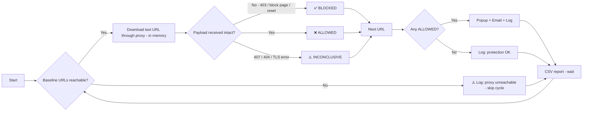

# 🛡️ SafeWeb

> PowerShell script that keeps your web proxy honest — detecting antivirus and URL-filtering failures through automated EICAR download testing

[](https://github.com/PowerShell/PowerShell)
[](LICENSE_GPL.md)
[](#)

🇫🇷 [Version française](README_FR.md)

---

## 📖 Description

**SafeWeb** is a PowerShell monitoring script that continuously tests the security filtering of your corporate **web proxy / secure web gateway**. It tries to download **EICAR test files** and public **reputation test pages** *through the proxy* to verify that its antivirus engine, SSL/TLS inspection, archive scanning and URL categorization are actually blocking threats.

If a test payload reaches the workstation intact, the proxy is **not** protecting your users — SafeWeb raises an alert.

### ✨ Key features

- 🔄 **Automated continuous monitoring** of the proxy filtering (or one-shot audit mode)
- 🦠 **5 EICAR variants**: HTTP, HTTPS, `.txt` extension bypass, ZIP, nested ZIP (recursive scan)
- 🌐 **Reputation / URL filtering tests**: malware, phishing, unwanted software, malicious JavaScript
- 🧠 **In-memory downloads** — nothing is written to disk, so the endpoint antivirus cannot skew the result
- 🔍 **Smart verdicts**: `BLOCKED`, `ALLOWED`, `INCONCLUSIVE` (HTTP codes, block-page keywords, TLS errors)
- 📡 **Connectivity baseline** before each cycle — no false "all blocked" when the proxy is down
- 🔐 **Proxy authentication**: SSO (Kerberos/NTLM) or explicit credentials
- 📝 **Detailed logging** + **CSV history** (Excel / SIEM ready)
- 📧 **Email alerts** via SMTP (TLS/SSL support)
- 🔔 **Visual popup alerts** for immediate notification
- 🛡️ **EICAR signature stored in Base64** — the script itself is not quarantined by your endpoint AV / AMSI
- 🛠️ **Easy configuration** — every URL is a variable, all settings in one section

---

## 🚀 Quick start

### Prerequisites

- Windows PowerShell 5.1 or higher (PowerShell 7 supported)
- Network access to the proxy to be tested
- SMTP server credentials for email notifications
- **Written approval from IT / SOC** — each cycle deliberately triggers alerts on the proxy, AV and SIEM consoles

### Installation

1. Download the script:

```powershell
# Clone or download the script file
Invoke-WebRequest -Uri "https://raw.githubusercontent.com/YOUR-GITHUB-USER/SafeWeb/refs/heads/master/SafeWeb.ps1" -OutFile "SafeWeb.ps1"
```

2. Edit the configuration section (lines 25-159):

```powershell
# Proxy to test
$useProxy                   = $true
$proxyAddress               = "http://proxy.company.local:8080"
$proxyUseDefaultCredentials = $true

# Email configuration
$adminEmail = "security@example.com"
$emailFrom  = "monitoring@example.com"

# SMTP settings
$smtpServer   = "smtp.example.com"
$smtpPort     = 587
$smtpUser     = "smtp-user@example.com"
$smtpPassword = "YourPassword"
```

3. Run the script:

```powershell
.\SafeWeb.ps1
```

---

## ⚙️ How it works



### Process flow

1. **Baseline check**: Verifies that at least one reference URL is reachable through the proxy
2. **Download**: Fetches each enabled test URL through the proxy, **in memory only**
3. **Verdict**:
   - EICAR files → looks for the EICAR signature in the received content
   - ZIP files → looks for the ZIP header (`PK\x03\x04`)
   - Web pages → HTTP 200 without a recognized block page
4. **Alert mechanism**: If at least one payload is `ALLOWED`:
   - 📝 Logs the error with timestamp
   - 🔔 Displays a popup warning
   - 📧 Sends an email notification with the list of unfiltered URLs
5. **Report**: Appends all results to the CSV history
6. **Loop**: Waits `$intervalMinutes` before the next cycle (or stops if `$runOnce = $true`)

### Verdicts

| Verdict | Meaning | Triggers |
|---|---|---|
| ✅ `BLOCKED` | The proxy did its job | HTTP 403/451, block-page keyword, neutralized content, connection reset |
| ❌ `ALLOWED` | **Threat reached the workstation** | EICAR signature / ZIP header received intact, page served without block |
| ⚠️ `INCONCLUSIVE` | Test could not conclude | HTTP 407 (proxy auth), 404/410 (obsolete URL), untrusted SSL inspection certificate |

---

## 🧪 Test URLs

Every URL is defined as a variable, then referenced in the `$testUrls` catalog. Set `Enabled = $false` to disable a test without removing it.

### Antivirus (EICAR — [eicar.org](https://www.eicar.org/))

| Variable | Test | What it validates |
|---|---|---|
| `$urlEicarHttpCom` | EICAR over HTTP | Basic AV scanning on clear-text traffic |
| `$urlEicarHttpsCom` | EICAR over HTTPS | **SSL/TLS inspection** (most common audit failure) |
| `$urlEicarHttpsTxt` | EICAR `.txt` over HTTPS | Content-based detection, not extension-based |
| `$urlEicarHttpsZip` | EICAR in ZIP | Archive scanning |
| `$urlEicarHttpsZip2` | EICAR in nested ZIP (2 levels) | Recursive archive scanning |

### Reputation / URL filtering

| Variable | Test | What it validates |
|---|---|---|
| `$urlGsbMalware` | Google Safe Browsing test – malware | "Malware" category blocking |
| `$urlGsbPhishing` | Google Safe Browsing test – phishing | "Phishing" category blocking |
| `$urlGsbUnwanted` | Google Safe Browsing test – unwanted software | "PUA / unwanted" category blocking |
| `$urlWicarMalware` | WICAR malicious JavaScript test page | Web content / script analysis |

### Baseline (connectivity)

| Variable | Default |
|---|---|
| `$urlBaselineGoogle` | `https://www.google.com/generate_204` |
| `$urlBaselineEicar` | `https://www.eicar.org/` |

### Adding a test

```powershell
$urlMyTest = "https://example.org/my-test-file.zip"

$testUrls += [PSCustomObject]@{ Enabled = $true; Name = "My test"; Category = "Antivirus"; CheckType = "Zip"; Url = $urlMyTest }
```

`CheckType` values: `EicarText`, `Zip`, `Page`.

---

## 🧰 Configuration parameters

### Proxy

| Variable | Description | Default | Example |
|---|---|---|---|
| `$useProxy` | Use the explicit proxy below | `$true` | `$false` = system proxy / PAC / direct |
| `$proxyAddress` | Proxy to test | Required | `"http://proxy.company.local:8080"` |
| `$proxyUseDefaultCredentials` | SSO with current account (Kerberos/NTLM) | `$true` | `$false` for explicit credentials |
| `$proxyUser` | Proxy username | — | `"DOMAIN\svc-safeweb"` |
| `$proxyPassword` | Proxy password (plain text) | — | Converted to SecureString |

### Block-page detection

| Variable | Description | Default |
|---|---|---|
| `$blockHttpCodes` | HTTP codes treated as a proxy block | `@(403, 451)` |
| `$blockPageKeywords` | Keywords identifying your proxy's block page | Zscaler, Forcepoint, Netskope, FortiGuard, Olfeo, "Access Denied"… |

> 💡 Add the exact wording of **your** block page to `$blockPageKeywords` — this is the key to reliable `Page` verdicts.

### Timing & behavior

| Variable | Description | Default | Example |
|---|---|---|---|
| `$intervalMinutes` | Interval between test cycles (minutes) | `15` | `30` |
| `$requestTimeoutSeconds` | Timeout per HTTP request (seconds) | `20` | `30` |
| `$runOnce` | Run one cycle then exit | `$false` | `$true` (audit / scheduled task) |
| `$enablePopup` | Show popup alerts (blocking) | `$true` | `$false` when running as SYSTEM |
| `$userAgent` | HTTP User-Agent sent to the proxy | Chrome-like + `SafeWeb/1.0` | Match your browser fleet |

### Logging

| Variable | Description | Default |
|---|---|---|
| `$logFile` | Path to log file | `.\SafeWebLog.txt` |
| `$csvReportFile` | CSV history (`;` separated, UTF-8). `""` to disable | `.\SafeWebReport.csv` |

### Email notification

| Variable | Description | Example |
|---|---|---|
| `$adminEmail` | Recipient email address | `"security@example.com"` |
| `$emailFrom` | Sender email address | `"monitoring@example.com"` |
| `$emailSubject` | Email subject line | `"[SafeWeb] ALERT - Proxy is not filtering malicious content"` |

### SMTP configuration

| Variable | Description | Default | Notes |
|---|---|---|---|
| `$smtpServer` | SMTP server hostname | Required | `"smtp.ionos.fr"` |
| `$smtpPort` | SMTP port number | `587` | 587=TLS, 465=SSL, 25=Clear |
| `$smtpUser` | SMTP username | Required | Usually full email address |
| `$smtpPassword` | SMTP password (plain text) | Required | Converted to SecureString |
| `$smtpUseTLS` | Enable TLS encryption | `$true` | For port 587 (STARTTLS) |
| `$smtpUseSSL` | Enable SSL encryption | `$false` | For port 465 |
| `$smtpTimeout` | Connection timeout (ms) | `30000` | 30 seconds |

### SMTP configuration examples

**For IONOS with TLS (Recommended):**
```powershell
$smtpServer = "smtp.ionos.fr"
$smtpPort   = 587
$smtpUseTLS = $true
$smtpUseSSL = $false
```

**For Gmail with SSL:**
```powershell
$smtpServer = "smtp.gmail.com"
$smtpPort   = 465
$smtpUseTLS = $false
$smtpUseSSL = $true
```

**For Office 365:**
```powershell
$smtpServer = "smtp.office365.com"
$smtpPort   = 587
$smtpUseTLS = $true
$smtpUseSSL = $false
```

---

## 📧 Email alert example

When at least one test payload goes through the proxy, you receive an email like this (default template is in French — see `$emailTemplate`):

```
Subject: [SafeWeb] ALERTE - Le proxy ne filtre pas les contenus malveillants

Bonjour,

Le controle SafeWeb a detecte que le proxy n'a PAS bloque les contenus de test suivants :

- [Antivirus] EICAR HTTPS ZIP x2
  URL    : https://secure.eicar.org/eicarcom2.zip
  Detail : Archive ZIP recue intacte (308 octets) - scan des archives inefficace

- [Reputation] Safe Browsing Phishing
  URL    : https://testsafebrowsing.appspot.com/s/phishing.html
  Detail : HTTP 200 sans page de blocage - categorie non filtree

Date   : 21/09/2026 10:15:42
Proxy  : http://proxy.company.local:8080
Poste  : WKS-SOC-01

Merci de verifier le moteur antivirus du proxy, l'inspection SSL/TLS, le scan des archives
et les abonnements de reputation/categorisation URL.

Cordialement,
Le script de supervision SafeWeb
```

---

## 📋 Log file format

The script creates a detailed log file (`SafeWebLog.txt`) with entries like (messages are in French):

```
21/09/2026_10:15:30 :: START :: ### Debut du script de test antivirus proxy SafeWeb ###
21/09/2026_10:15:30 :: START :: Script demarre - 9 test(s) actif(s) - Proxy : http://proxy.company.local:8080
21/09/2026_10:15:30 :: INFO :: Configuration : intervalle = 15 min, timeout = 20 s, RunOnce = False
21/09/2026_10:15:30 :: INFO :: ### Nouveau cycle de test ###
21/09/2026_10:15:31 :: DEBUG :: Connectivite de reference OK : https://www.google.com/generate_204
21/09/2026_10:15:31 :: INFO :: Test 1/9 [Antivirus] EICAR HTTP .com : http://www.eicar.org/download/eicar.com
21/09/2026_10:15:32 :: SUCCESS :: EICAR HTTP .com : BLOQUE - HTTP 403 renvoye par le proxy
21/09/2026_10:15:32 :: INFO :: Test 2/9 [Antivirus] EICAR HTTPS .com : https://secure.eicar.org/eicar.com
21/09/2026_10:15:33 :: SUCCESS :: EICAR HTTPS .com : BLOQUE - Contenu remplace/neutralise (page de blocage : 'Virus Detected')
...
21/09/2026_10:15:38 :: ERROR :: EICAR HTTPS ZIP x2 : NON BLOQUE - Archive ZIP recue intacte (308 octets) - scan des archives inefficace
...
21/09/2026_10:15:41 :: INFO :: Bilan : 7 bloque(s), 2 non bloque(s), 0 non concluant(s)
21/09/2026_10:15:42 :: SUCCESS :: Email envoye a security@example.com via smtp.ionos.fr:587 (TLS)
21/09/2026_10:15:42 :: INFO :: ### Cycle de test termine ###
```

### Log levels

- **START**: Script initialization
- **INFO**: General information
- **SUCCESS**: Payload blocked — proxy working correctly
- **ERROR**: Payload allowed — filtering failure detected
- **WARNING**: Inconclusive test or non-critical issue
- **DEBUG**: Technical details (baseline, SMTP, etc.)

### CSV report

Each cycle appends one line per test to `SafeWebReport.csv`:

```
"Date";"Name";"Category";"Url";"Status";"Detail"
"21/09/2026 10:15:32";"EICAR HTTP .com";"Antivirus";"http://www.eicar.org/download/eicar.com";"BLOCKED";"HTTP 403 renvoye par le proxy"
```

---

## 🔧 Advanced usage

### Running as a scheduled task

One audit every hour, as a dedicated service account (recommended — the proxy policy applied to SYSTEM often differs from the user policy):

```powershell
# In SafeWeb.ps1: $runOnce = $true ; $enablePopup = $false
$action    = New-ScheduledTaskAction -Execute "PowerShell.exe" -Argument "-NoProfile -ExecutionPolicy Bypass -File C:\Scripts\SafeWeb.ps1" -WorkingDirectory "C:\Scripts"
$trigger   = New-ScheduledTaskTrigger -Once -At (Get-Date) -RepetitionInterval (New-TimeSpan -Hours 1)
$principal = New-ScheduledTaskPrincipal -UserId "DOMAIN\svc-safeweb" -LogonType Password -RunLevel Limited
Register-ScheduledTask -TaskName "SafeWeb-Monitor" -Action $action -Trigger $trigger -Principal $principal
```

### Testing the "real" user path (PAC / system proxy)

To test exactly what users get (WPAD/PAC, transparent proxy, SASE agent), disable the explicit proxy:

```powershell
$useProxy = $false
```

### Customizing the email template

Edit `$emailTemplate` (`{0}` = unfiltered tests, `{1}` = date, `{2}` = proxy, `{3}` = hostname):

```powershell
$emailTemplate = @"
⚠️ SECURITY ALERT ⚠️

The web proxy let malicious test content through!

{0}
Detection time : {1}
Proxy          : {2}
Host           : {3}
Severity       : CRITICAL

This is an automated message from SafeWeb.
"@
```

### Quick test

```powershell
$runOnce     = $true   # Single cycle
$enablePopup = $false  # No popup
```

---

## 🐛 Troubleshooting

### Common issues

**1. Every cycle is skipped**
```
ERROR :: Aucune URL de reference joignable via http://proxy... - cycle ignore
```
**Solution:**
- Check `$proxyAddress` and port
- Test manually: `Invoke-WebRequest https://www.google.com/generate_204 -Proxy http://proxy:8080 -ProxyUseDefaultCredentials`
- Confirm the firewall allows the workstation to reach the proxy

**2. HTTP 407 – inconclusive tests**
```
WARNING :: EICAR HTTPS .com : NON CONCLUANT - HTTP 407 - echec d'authentification proxy
```
**Solution:**
- Run the script with an account allowed to browse
- Or set `$proxyUseDefaultCredentials = $false` and fill `$proxyUser` / `$proxyPassword`

**3. TLS error – inconclusive HTTPS tests**
```
WARNING :: ... Erreur TLS - certificat d'inspection SSL du proxy non approuve ?
```
**Solution:**
- Deploy the proxy's SSL inspection root CA to the machine's *Trusted Root* store
- Check that the account running the script sees that certificate

**4. Web pages reported as ALLOWED although they are blocked in the browser**

**Solution:**
- Your block page wording is not in `$blockPageKeywords` — add it
- The browser may block via its own Safe Browsing, not the proxy: SafeWeb only measures the proxy

**5. HTTP 404 – obsolete URL**

**Solution:**
- Test vendors sometimes move their files: update the matching `$url...` variable

**6. Email not sending**
```
ERROR :: Echec de l'envoi SMTP : Authentication failed
```
**Solution:**
- Verify SMTP credentials
- Check if 2FA is enabled (use an app password)
- Confirm firewall allows outbound SMTP traffic

---

## 📊 Best practices

✅ **Do:**
- Get **written approval** from IT/SOC and whitelist the alerts in your SIEM correlation rules
- Test the script with `$runOnce = $true` first
- Use a dedicated service account with standard browsing rights
- Run it from several network zones (HQ, branch, VPN, Wi-Fi guest) — policies often differ
- Keep `$blockPageKeywords` aligned with your proxy vendor
- Review the CSV history after every proxy policy change or upgrade
- Use TLS/SSL for SMTP connections

❌ **Don't:**
- Run with Domain Admin credentials
- Set `$intervalMinutes` too low (< 5 minutes) — you will flood your SOC
- Ignore `INCONCLUSIVE` results: a 407 or TLS error hides the real status
- Store SMTP / proxy passwords in plain text in a shared location
- Run it on a network you are not authorized to test

---

## 📜 What is EICAR?

The **EICAR test file** is an industry standard used to test antivirus software without using actual malware. It's a 68-byte text file recognized by all antivirus engines as a "virus" but is completely harmless.

SafeWeb stores the signature **Base64-encoded** so that the script itself is not detected by your endpoint antivirus or AMSI. It is decoded in memory only to compare with the downloaded content.

More info: [EICAR.org](https://www.eicar.org/)

---

## 🤝 Contributing

Contributions are welcome! Please:
1. Fork the repository
2. Create a feature branch (`git checkout -b feature/improvement`)
3. Commit your changes (`git commit -am 'Add new feature'`)
4. Push to the branch (`git push origin feature/improvement`)
5. Open a Pull Request

---

## 📄 License

This project is licensed under the GPL v3 License — see the [LICENSE](LICENSE_GPL.md) file for details.

---

## 👨‍💻 Author

**YOUR NAME / COMPANY**
- Website: [your-website.com](https://your-website.com)
- Email: contact@your-website.com

---

## 🔗 Related projects

- [SafeNAS](https://github.com/jbianco-prog/SafeNAS) - Antivirus monitoring on network shares with EICAR (SafeWeb's inspiration)
- [EICAR Test Files](https://www.eicar.org/) - Standard antivirus test files
- [Google Safe Browsing test pages](https://testsafebrowsing.appspot.com/) - Reputation test URLs
- [WICAR](https://www.wicar.org/) - Web browser malware test pages

---

## ⭐ Support

If you find this script useful, please consider:
- ⭐ Starring the repository
- 🐛 Reporting issues
- 💡 Suggesting improvements
- 📢 Sharing with others

---

**Last updated:** September 21, 2026  
**Version:** 1.0 (SafeWeb), built by humans augmented by AI  
**Tested on:** Windows Server 2019/2022, Windows 10/11
