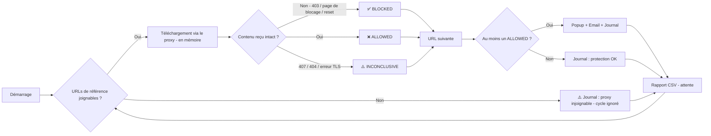

# 🛡️ SafeWeb

> Script PowerShell qui vérifie que votre proxy web vous protège réellement — détection des défaillances antivirus et de filtrage URL par tests automatisés de téléchargement EICAR

[](https://github.com/PowerShell/PowerShell)
[](LICENSE_GPL.md)
[](#)

🇬🇧 [English version](README.md)

---

## 📖 Description

**SafeWeb** est un script de surveillance PowerShell qui teste en continu le filtrage de sécurité de votre **proxy web / passerelle web sécurisée** d'entreprise. Il tente de télécharger des **fichiers de test EICAR** et des **pages de test de réputation** publiques *à travers le proxy* pour vérifier que son moteur antivirus, l'inspection SSL/TLS, l'analyse des archives et la catégorisation des URL bloquent réellement les menaces.

Si un contenu de test atteint le poste intact, le proxy **ne protège pas** vos utilisateurs — SafeWeb déclenche une alerte.

### ✨ Fonctionnalités principales

- 🔄 **Surveillance continue automatisée** du filtrage proxy (ou mode audit ponctuel)
- 🦠 **5 variantes EICAR** : HTTP, HTTPS, contournement par extension `.txt`, ZIP, ZIP imbriqué (analyse récursive)
- 🌐 **Tests de réputation / filtrage URL** : malware, phishing, logiciel indésirable, JavaScript malveillant
- 🧠 **Téléchargement en mémoire** — rien n'est écrit sur disque, l'antivirus du poste ne peut pas fausser le résultat
- 🔍 **Verdicts intelligents** : `BLOCKED`, `ALLOWED`, `INCONCLUSIVE` (codes HTTP, mots-clés de page de blocage, erreurs TLS)
- 📡 **Contrôle de connectivité** avant chaque cycle — pas de faux « tout est bloqué » quand le proxy est tombé
- 🔐 **Authentification proxy** : SSO (Kerberos/NTLM) ou identifiants explicites
- 📝 **Journalisation détaillée** + **historique CSV** (prêt pour Excel / SIEM)
- 📧 **Alertes email** via SMTP (support TLS/SSL)
- 🔔 **Alertes popup visuelles** pour notification immédiate
- 🛡️ **Signature EICAR stockée en Base64** — le script n'est pas mis en quarantaine par l'antivirus du poste / AMSI
- 🛠️ **Configuration facile** — chaque URL est une variable, tous les paramètres dans une seule section

---

## 🚀 Démarrage rapide

### Prérequis

- Windows PowerShell 5.1 ou supérieur (PowerShell 7 supporté)
- Accès réseau au proxy à tester
- Identifiants serveur SMTP pour les notifications email
- **Accord écrit de la DSI / du SOC** — chaque cycle déclenche volontairement des alertes sur les consoles proxy, antivirus et SIEM

### Installation

1. Téléchargez le script :

```powershell
# Clonez ou téléchargez le fichier script
Invoke-WebRequest -Uri "https://raw.githubusercontent.com/YOUR-GITHUB-USER/SafeWeb/refs/heads/master/SafeWeb.ps1" -OutFile "SafeWeb.ps1"
```

2. Éditez la section configuration (lignes 25-159) :

```powershell
# Proxy à tester
$useProxy                   = $true
$proxyAddress               = "http://proxy.entreprise.local:8080"
$proxyUseDefaultCredentials = $true

# Configuration email
$adminEmail = "securite@exemple.com"
$emailFrom  = "surveillance@exemple.com"

# Paramètres SMTP
$smtpServer   = "smtp.exemple.com"
$smtpPort     = 587
$smtpUser     = "smtp-user@exemple.com"
$smtpPassword = "VotreMotDePasse"
```

3. Exécutez le script :

```powershell
.\SafeWeb.ps1
```

---

## ⚙️ Fonctionnement



### Flux de traitement

1. **Contrôle de référence** : Vérifie qu'au moins une URL de référence est joignable via le proxy
2. **Téléchargement** : Récupère chaque URL de test active à travers le proxy, **uniquement en mémoire**
3. **Verdict** :
   - Fichiers EICAR → recherche de la signature EICAR dans le contenu reçu
   - Fichiers ZIP → recherche de l'en-tête ZIP (`PK\x03\x04`)
   - Pages web → HTTP 200 sans page de blocage reconnue
4. **Mécanisme d'alerte** : Si au moins un contenu est `ALLOWED` :
   - 📝 Journalise l'erreur avec horodatage
   - 🔔 Affiche une alerte popup
   - 📧 Envoie une notification email avec la liste des URL non filtrées
5. **Rapport** : Ajoute tous les résultats à l'historique CSV
6. **Boucle** : Attend `$intervalMinutes` avant le cycle suivant (ou s'arrête si `$runOnce = $true`)

### Verdicts

| Verdict | Signification | Déclencheurs |
|---|---|---|
| ✅ `BLOCKED` | Le proxy a fait son travail | HTTP 403/451, mot-clé de page de blocage, contenu neutralisé, connexion coupée |
| ❌ `ALLOWED` | **La menace a atteint le poste** | Signature EICAR / en-tête ZIP reçus intacts, page servie sans blocage |
| ⚠️ `INCONCLUSIVE` | Le test n'a pas pu conclure | HTTP 407 (authentification proxy), 404/410 (URL obsolète), certificat d'inspection SSL non approuvé |

---

## 🧪 URLs de test

Chaque URL est définie en variable, puis référencée dans le catalogue `$testUrls`. Passez `Enabled = $false` pour désactiver un test sans le supprimer.

### Antivirus (EICAR — [eicar.org](https://www.eicar.org/))

| Variable | Test | Ce qui est validé |
|---|---|---|
| `$urlEicarHttpCom` | EICAR en HTTP | Analyse antivirus de base sur le trafic en clair |
| `$urlEicarHttpsCom` | EICAR en HTTPS | **Inspection SSL/TLS** (échec le plus fréquent en audit) |
| `$urlEicarHttpsTxt` | EICAR `.txt` en HTTPS | Détection sur le contenu et non sur l'extension |
| `$urlEicarHttpsZip` | EICAR dans un ZIP | Analyse des archives |
| `$urlEicarHttpsZip2` | EICAR dans un ZIP imbriqué (2 niveaux) | Analyse récursive des archives |

### Réputation / filtrage URL

| Variable | Test | Ce qui est validé |
|---|---|---|
| `$urlGsbMalware` | Test Google Safe Browsing – malware | Blocage de la catégorie « malware » |
| `$urlGsbPhishing` | Test Google Safe Browsing – phishing | Blocage de la catégorie « phishing » |
| `$urlGsbUnwanted` | Test Google Safe Browsing – logiciel indésirable | Blocage de la catégorie « PUA / indésirable » |
| `$urlWicarMalware` | Page de test WICAR (JavaScript malveillant) | Analyse du contenu web / des scripts |

### Référence (connectivité)

| Variable | Défaut |
|---|---|
| `$urlBaselineGoogle` | `https://www.google.com/generate_204` |
| `$urlBaselineEicar` | `https://www.eicar.org/` |

### Ajouter un test

```powershell
$urlMonTest = "https://exemple.org/mon-fichier-test.zip"

$testUrls += [PSCustomObject]@{ Enabled = $true; Name = "Mon test"; Category = "Antivirus"; CheckType = "Zip"; Url = $urlMonTest }
```

Valeurs de `CheckType` : `EicarText`, `Zip`, `Page`.

---

## 🧰 Paramètres de configuration

### Proxy

| Variable | Description | Défaut | Exemple |
|---|---|---|---|
| `$useProxy` | Utiliser le proxy explicite ci-dessous | `$true` | `$false` = proxy système / PAC / direct |
| `$proxyAddress` | Proxy à tester | Requis | `"http://proxy.entreprise.local:8080"` |
| `$proxyUseDefaultCredentials` | SSO avec le compte courant (Kerberos/NTLM) | `$true` | `$false` pour des identifiants explicites |
| `$proxyUser` | Nom d'utilisateur proxy | — | `"DOMAINE\svc-safeweb"` |
| `$proxyPassword` | Mot de passe proxy (texte clair) | — | Converti en SecureString |

### Détection des pages de blocage

| Variable | Description | Défaut |
|---|---|---|
| `$blockHttpCodes` | Codes HTTP considérés comme un blocage proxy | `@(403, 451)` |
| `$blockPageKeywords` | Mots-clés identifiant la page de blocage de votre proxy | Zscaler, Forcepoint, Netskope, FortiGuard, Olfeo, « Accès refusé »… |

> 💡 Ajoutez le texte exact de **votre** page de blocage dans `$blockPageKeywords` — c'est la clé de verdicts `Page` fiables.

### Timing & comportement

| Variable | Description | Défaut | Exemple |
|---|---|---|---|
| `$intervalMinutes` | Intervalle entre les cycles de test (minutes) | `15` | `30` |
| `$requestTimeoutSeconds` | Timeout par requête HTTP (secondes) | `20` | `30` |
| `$runOnce` | Exécuter un seul cycle puis quitter | `$false` | `$true` (audit / tâche planifiée) |
| `$enablePopup` | Afficher les popups d'alerte (bloquantes) | `$true` | `$false` sous le compte SYSTEM |
| `$userAgent` | User-Agent HTTP envoyé au proxy | Type Chrome + `SafeWeb/1.0` | Aligné sur votre parc de navigateurs |

### Journalisation

| Variable | Description | Défaut |
|---|---|---|
| `$logFile` | Chemin du fichier journal | `.\SafeWebLog.txt` |
| `$csvReportFile` | Historique CSV (séparateur `;`, UTF-8). `""` pour désactiver | `.\SafeWebReport.csv` |

### Notification email

| Variable | Description | Exemple |
|---|---|---|
| `$adminEmail` | Adresse email du destinataire | `"securite@exemple.com"` |
| `$emailFrom` | Adresse email de l'expéditeur | `"surveillance@exemple.com"` |
| `$emailSubject` | Ligne d'objet de l'email | `"[SafeWeb] ALERTE - Le proxy ne filtre pas les contenus malveillants"` |

### Configuration SMTP

| Variable | Description | Défaut | Notes |
|---|---|---|---|
| `$smtpServer` | Nom d'hôte du serveur SMTP | Requis | `"smtp.ionos.fr"` |
| `$smtpPort` | Numéro de port SMTP | `587` | 587=TLS, 465=SSL, 25=Clair |
| `$smtpUser` | Nom d'utilisateur SMTP | Requis | Généralement l'adresse email complète |
| `$smtpPassword` | Mot de passe SMTP (texte clair) | Requis | Converti en SecureString |
| `$smtpUseTLS` | Activer le chiffrement TLS | `$true` | Pour le port 587 (STARTTLS) |
| `$smtpUseSSL` | Activer le chiffrement SSL | `$false` | Pour le port 465 |
| `$smtpTimeout` | Délai de connexion (ms) | `30000` | 30 secondes |

### Exemples de configuration SMTP

**Pour IONOS avec TLS (Recommandé) :**
```powershell
$smtpServer = "smtp.ionos.fr"
$smtpPort   = 587
$smtpUseTLS = $true
$smtpUseSSL = $false
```

**Pour Gmail avec SSL :**
```powershell
$smtpServer = "smtp.gmail.com"
$smtpPort   = 465
$smtpUseTLS = $false
$smtpUseSSL = $true
```

**Pour Office 365 :**
```powershell
$smtpServer = "smtp.office365.com"
$smtpPort   = 587
$smtpUseTLS = $true
$smtpUseSSL = $false
```

---

## 📧 Exemple d'alerte email

Lorsqu'au moins un contenu de test traverse le proxy, vous recevez un email comme celui-ci :

```
Objet : [SafeWeb] ALERTE - Le proxy ne filtre pas les contenus malveillants

Bonjour,

Le controle SafeWeb a detecte que le proxy n'a PAS bloque les contenus de test suivants :

- [Antivirus] EICAR HTTPS ZIP x2
  URL    : https://secure.eicar.org/eicarcom2.zip
  Detail : Archive ZIP recue intacte (308 octets) - scan des archives inefficace

- [Reputation] Safe Browsing Phishing
  URL    : https://testsafebrowsing.appspot.com/s/phishing.html
  Detail : HTTP 200 sans page de blocage - categorie non filtree

Date   : 21/09/2026 10:15:42
Proxy  : http://proxy.entreprise.local:8080
Poste  : WKS-SOC-01

Merci de verifier le moteur antivirus du proxy, l'inspection SSL/TLS, le scan des archives
et les abonnements de reputation/categorisation URL.

Cordialement,
Le script de supervision SafeWeb
```

---

## 📋 Format du fichier journal

Le script crée un fichier journal détaillé (`SafeWebLog.txt`) avec des entrées comme :

```
21/09/2026_10:15:30 :: START :: ### Debut du script de test antivirus proxy SafeWeb ###
21/09/2026_10:15:30 :: START :: Script demarre - 9 test(s) actif(s) - Proxy : http://proxy.entreprise.local:8080
21/09/2026_10:15:30 :: INFO :: Configuration : intervalle = 15 min, timeout = 20 s, RunOnce = False
21/09/2026_10:15:30 :: INFO :: ### Nouveau cycle de test ###
21/09/2026_10:15:31 :: DEBUG :: Connectivite de reference OK : https://www.google.com/generate_204
21/09/2026_10:15:31 :: INFO :: Test 1/9 [Antivirus] EICAR HTTP .com : http://www.eicar.org/download/eicar.com
21/09/2026_10:15:32 :: SUCCESS :: EICAR HTTP .com : BLOQUE - HTTP 403 renvoye par le proxy
21/09/2026_10:15:32 :: INFO :: Test 2/9 [Antivirus] EICAR HTTPS .com : https://secure.eicar.org/eicar.com
21/09/2026_10:15:33 :: SUCCESS :: EICAR HTTPS .com : BLOQUE - Contenu remplace/neutralise (page de blocage : 'Virus Detected')
...
21/09/2026_10:15:38 :: ERROR :: EICAR HTTPS ZIP x2 : NON BLOQUE - Archive ZIP recue intacte (308 octets) - scan des archives inefficace
...
21/09/2026_10:15:41 :: INFO :: Bilan : 7 bloque(s), 2 non bloque(s), 0 non concluant(s)
21/09/2026_10:15:42 :: SUCCESS :: Email envoye a securite@exemple.com via smtp.ionos.fr:587 (TLS)
21/09/2026_10:15:42 :: INFO :: ### Cycle de test termine ###
```

### Niveaux de journal

- **START** : Initialisation du script
- **INFO** : Information générale
- **SUCCESS** : Contenu bloqué — proxy fonctionnant correctement
- **ERROR** : Contenu autorisé — défaillance du filtrage détectée
- **WARNING** : Test non concluant ou problème non critique
- **DEBUG** : Détails techniques (référence, SMTP, etc.)

### Rapport CSV

Chaque cycle ajoute une ligne par test dans `SafeWebReport.csv` :

```
"Date";"Name";"Category";"Url";"Status";"Detail"
"21/09/2026 10:15:32";"EICAR HTTP .com";"Antivirus";"http://www.eicar.org/download/eicar.com";"BLOCKED";"HTTP 403 renvoye par le proxy"
```

---

## 🔧 Utilisation avancée

### Exécution en tâche planifiée

Un audit toutes les heures, avec un compte de service dédié (recommandé — la politique proxy appliquée au compte SYSTEM diffère souvent de celle des utilisateurs) :

```powershell
# Dans SafeWeb.ps1 : $runOnce = $true ; $enablePopup = $false
$action    = New-ScheduledTaskAction -Execute "PowerShell.exe" -Argument "-NoProfile -ExecutionPolicy Bypass -File C:\Scripts\SafeWeb.ps1" -WorkingDirectory "C:\Scripts"
$trigger   = New-ScheduledTaskTrigger -Once -At (Get-Date) -RepetitionInterval (New-TimeSpan -Hours 1)
$principal = New-ScheduledTaskPrincipal -UserId "DOMAINE\svc-safeweb" -LogonType Password -RunLevel Limited
Register-ScheduledTask -TaskName "SafeWeb-Monitor" -Action $action -Trigger $trigger -Principal $principal
```

### Tester le chemin « réel » des utilisateurs (PAC / proxy système)

Pour tester exactement ce que voient les utilisateurs (WPAD/PAC, proxy transparent, agent SASE), désactivez le proxy explicite :

```powershell
$useProxy = $false
```

### Personnalisation du modèle d'email

Éditez `$emailTemplate` (`{0}` = tests non filtrés, `{1}` = date, `{2}` = proxy, `{3}` = nom du poste) :

```powershell
$emailTemplate = @"
⚠️ ALERTE SÉCURITÉ ⚠️

Le proxy web a laissé passer des contenus de test malveillants !

{0}
Heure de détection : {1}
Proxy              : {2}
Poste              : {3}
Gravité            : CRITIQUE

Ceci est un message automatisé de SafeWeb.
"@
```

### Test rapide

```powershell
$runOnce     = $true   # Un seul cycle
$enablePopup = $false  # Pas de popup
```

---

## 🐛 Dépannage

### Problèmes courants

**1. Tous les cycles sont ignorés**
```
ERROR :: Aucune URL de reference joignable via http://proxy... - cycle ignore
```
**Solution :**
- Vérifiez `$proxyAddress` et le port
- Testez manuellement : `Invoke-WebRequest https://www.google.com/generate_204 -Proxy http://proxy:8080 -ProxyUseDefaultCredentials`
- Confirmez que le pare-feu autorise le poste à joindre le proxy

**2. HTTP 407 – tests non concluants**
```
WARNING :: EICAR HTTPS .com : NON CONCLUANT - HTTP 407 - echec d'authentification proxy
```
**Solution :**
- Exécutez le script avec un compte autorisé à naviguer
- Ou passez `$proxyUseDefaultCredentials = $false` et renseignez `$proxyUser` / `$proxyPassword`

**3. Erreur TLS – tests HTTPS non concluants**
```
WARNING :: ... Erreur TLS - certificat d'inspection SSL du proxy non approuve ?
```
**Solution :**
- Déployez l'AC racine d'inspection SSL du proxy dans le magasin *Autorités de certification racines de confiance* du poste
- Vérifiez que le compte qui exécute le script voit bien ce certificat

**4. Pages web signalées ALLOWED alors qu'elles sont bloquées dans le navigateur**

**Solution :**
- Le texte de votre page de blocage n'est pas dans `$blockPageKeywords` — ajoutez-le
- Le navigateur bloque peut-être via son propre Safe Browsing, et non le proxy : SafeWeb ne mesure que le proxy

**5. HTTP 404 – URL obsolète**

**Solution :**
- Les éditeurs déplacent parfois leurs fichiers de test : mettez à jour la variable `$url...` correspondante

**6. Email non envoyé**
```
ERROR :: Echec de l'envoi SMTP : Echec de l'authentification
```
**Solution :**
- Vérifiez que les identifiants SMTP sont corrects
- Vérifiez si l'authentification à deux facteurs est activée (utilisez un mot de passe d'application)
- Confirmez que le pare-feu autorise le trafic SMTP sortant

---

## 📊 Bonnes pratiques

✅ **À faire :**
- Obtenir un **accord écrit** de la DSI/du SOC et prévoir les alertes dans vos règles de corrélation SIEM
- Tester d'abord le script avec `$runOnce = $true`
- Utiliser un compte de service dédié avec des droits de navigation standards
- L'exécuter depuis plusieurs zones réseau (siège, agence, VPN, Wi-Fi invité) — les politiques diffèrent souvent
- Maintenir `$blockPageKeywords` aligné sur votre éditeur de proxy
- Relire l'historique CSV après chaque changement de politique ou mise à jour du proxy
- Utiliser TLS/SSL pour les connexions SMTP

❌ **À ne pas faire :**
- Exécuter avec des identifiants d'administrateur de domaine
- Définir `$intervalMinutes` trop bas (< 5 minutes) — vous allez inonder votre SOC
- Ignorer les résultats `INCONCLUSIVE` : un 407 ou une erreur TLS masque l'état réel
- Stocker les mots de passe SMTP / proxy en texte clair dans un emplacement partagé
- L'exécuter sur un réseau que vous n'êtes pas autorisé à tester

---

## 📜 Qu'est-ce qu'EICAR ?

Le **fichier de test EICAR** est un standard utilisé pour tester les logiciels antivirus sans utiliser de véritable malware. C'est un fichier texte de 68 octets reconnu par tous les antivirus comme un « virus » mais qui est totalement inoffensif.

SafeWeb stocke la signature **encodée en Base64** afin que le script lui-même ne soit pas détecté par l'antivirus du poste ou par AMSI. Elle n'est décodée qu'en mémoire pour être comparée au contenu téléchargé.

Plus d'infos : [EICAR.org](https://www.eicar.org/)

---

## 🤝 Contribuer

Les contributions sont les bienvenues ! Veuillez :
1. Forker le dépôt
2. Créer une branche de fonctionnalité (`git checkout -b feature/amelioration`)
3. Commiter vos modifications (`git commit -am 'Ajout d'une nouvelle fonctionnalité'`)
4. Pousser vers la branche (`git push origin feature/amelioration`)
5. Ouvrir une Pull Request

---

## 📄 Licence

Ce projet est sous licence GPL v3 — voir le fichier [LICENSE](LICENSE_GPL.md) pour plus de détails.

---

## 👨‍💻 Auteur

**Micro-one**
- Website: [micro-one.com](https://micro-one.com)
- Email: contact@micro-one.com

---

## 🔗 Projets connexes

- [SafeNAS](https://github.com/jbianco-prog/SafeNAS) - Surveillance antivirus des partages réseau par EICAR (source d'inspiration de SafeWeb)
- [Fichiers de test EICAR](https://www.eicar.org/) - Fichiers de test antivirus standards
- [Pages de test Google Safe Browsing](https://testsafebrowsing.appspot.com/) - URLs de test de réputation
- [WICAR](https://www.wicar.org/) - Pages de test de malware pour navigateur

---

## ⭐ Support

Si vous trouvez ce script utile, pensez à :
- ⭐ Mettre une étoile au dépôt
- 🐛 Signaler des problèmes
- 💡 Suggérer des améliorations
- 📢 Partager avec d'autres

---

**Dernière mise à jour :** 21 septembre 2026  
**Version :** 1.0 (SafeWeb), conçu par des humains augmentés par l'IA  
**Testé sur :** Windows 11
